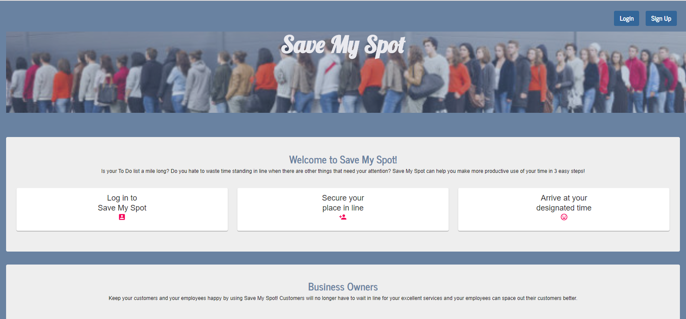
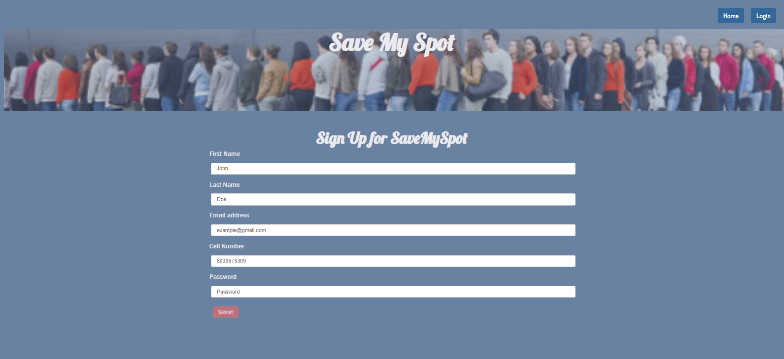
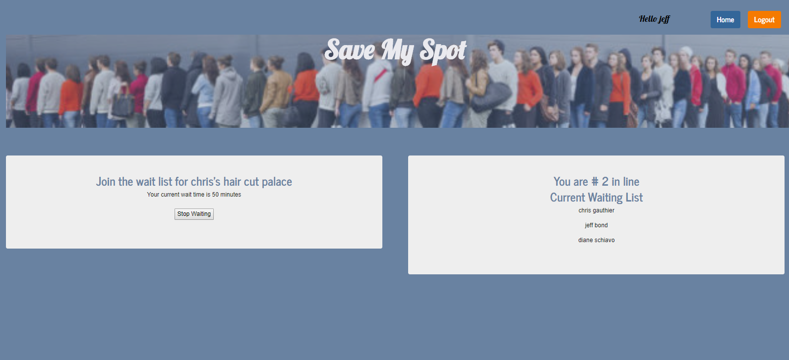
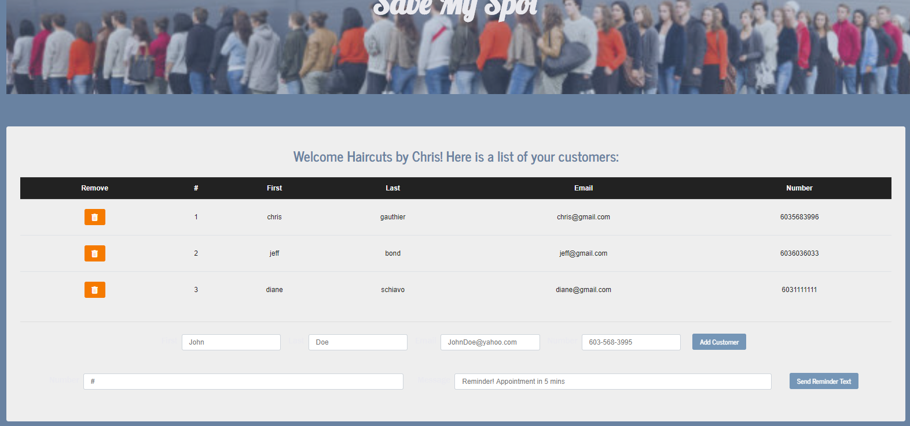

# Save My Spot
Save-My-Spot, is an easy to use QMA (Queue Management Application) that streamlines waitlists for first come first serve organizations and their customers. Organizations like the Department of Motor Vehicles or even your local Barber Shop can easily allow customers to remotely see current wait times and save their spot in line. 

## MVP Features
- Customers can sign up, login, save their spot in line, see estimated wait times, and remove themselves from a queue
- Organizations can add and remove customers from the queue and text specific customers 
- Customer and Organization views are always kept up to date whenever any changes are made to wait lists and wait time

## Demonstration
You can try Save My Spot on Heroku by clicking [here](https://save-my-spot.herokuapp.com/)

## Source Code Repository on GitHub 
You can get access to the source code on GitHub by clicking [here](https://github.com/Chrsgauthier5/SaveMySpot)

## Sample Images
The Home Page describes the advantages and capabilities of the Save-My-Spot application for users and businesses:

The Registration Page allows users to sign up to use the system. A user must have a unique email address which will differentiate them from all other users:

The User Page allows the user to add themselves to or remove themselves from the wait list. When on the wait list the screen displays the number in line and estimates the current wait time:

The Business Page allows the business to manage their wait list which includes both adding and removing users from the current list. Businesses can also send wa quick text to their users using twilio:

## Local Setup
In order to set this up you will need to do the following:
1. Copy the GitHub repository URL at https://github.com/Chrsgauthier5/SaveMySpot
2. Clone a local GitHub repository 
3. Run NPM Install to be sure you have all of the dependencies
4. Set up your own .env file in the root directory
5. In your .env file add SECRET="ANYTHING"
6. Sign up for your own twilio account and add the following to your .env file
* ACCOUNTSID='your acct id'
* AUTHTOKEN = 'your token'
* NUMBER='your phone number'
7. In order to run the application use the following
* go to the root and run node server.js
* go to /client and run npm start 

## Team
Save-My-Spot was designed and developed by Chris Gauthier, Diane Schiavo, and Jeff Bond for UNH/Trilogy Education Full Stack Web Developer Boot Camp Project 3.
